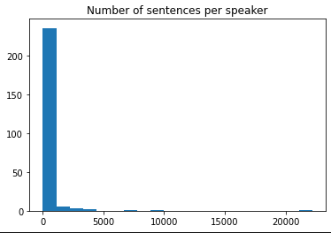
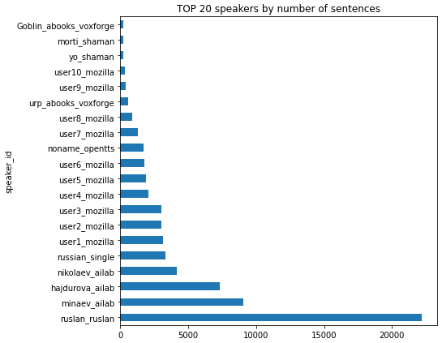

## Usage docuemntation 
> Note this a draft because the project is still in development 

To use the project you will need to isntall russian graphem to phoneme:

    git init
    git clone https://github.com/nsu-ai/russian_g2p.git\
    cd russian_g2p
    pip3 install -r requirements.txt
    pip install .

### Set paths in config.yaml
- tts.weights_path - path to pretrained FastSpeech model
- add speakers_json to the same folder as model weights - speaker names
- add sats_json to the same folder as model weights - raw data pitch and energy stats
- hifi.weights_path - path to pretrnained HIFI Gan

If all is set check the notebook "examples.ipynb"

## Dataset review

- total speakers 249
- numer of speakers with more than 100 sentences: 39

